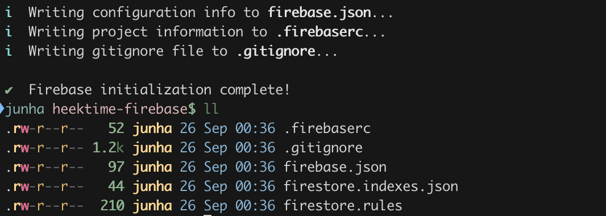

+++
title = "Firestore 보안 규칙 작성 시작하기"
description = "보안 규칙을 작성해서 Firestore에 허용되지 않는 접근을 막는 방법을 차근차근 알아봅니다."
date = "2023-02-04"

[taxonomies]
tags = ["serverless", "firebase", "firestore", "gcp"]

[extra]
featured = true
+++

<figure class="flex flex-col items-center">

<div class="not-prose w-full">
<pre class="mermaid">
sequenceDiagram
    participant Client
    participant Secured Server
    participant RDB
    Client->>Secured Server: GET /timetables/3
    rect rgba(122, 255, 122, .2)
    Note over Secured Server,RDB: 신뢰할 수 있는 서버의 요청
    Secured Server->>RDB: SELECT * FROM timetable WHERE id = 3
    end
</pre>
</div>

<figcaption>이전 방식: 신뢰할 수 있는 서버 로직에 의한 데이터 접근</figcaption>
</figure>

이전 방식에서 RDB에 접근하는 주체는 서버 프로그램이었습니다. 사용자는 임의로 DB에 접속할 수 없습니다. 접속할 수 있는 계정이 없기도 하고 일반적으로 네트워크 자체를 분리시키기도 합니다. 따라서 사용자는 보호된 서버 로직에 의해서만 DB에 접근할 수 있습니다. 하지만 새 아키텍처에서 Firestore에 접근하는 주체는 웹페이지, 즉 클라이언트입니다. Firestore는 공개 인터넷에서 접근할 수 있고, 접근 주체도 예전처럼 신뢰할 수 있는 주체가 아닙니다. 때문에 허용하지 않는 접근을 막아낼 수 있는 수단이 필요합니다.

Firestore에서는 [보안 규칙](https://firebase.google.com/docs/firestore/security/get-started)을 설정해서 허가하지 않은 데이터 읽기, 쓰기 또는 수정을 막을 수 있습니다. 보안 규칙은 *Firebase 인증*과 긴밀하게 엮여 있습니다. Firebase 인증으로 로그인한 유저만 접근을 허용할 수도 있고, 특정 유저만 접근할 수 있도록 제한할 수도 있습니다. 또는 특정 스키마를 강제할 수도 있습니다.

Firestore 보안 규칙은 자체적으로 정의한 언어로 작성합니다. 보안 규칙 언어는 단순하지만 생각보다 많은 일을 할 수 있습니다. 이를테면, 데이터베이스에 있는 값을 가져와 그 값을 가지고 접근 허용 여부를 판단할 수도 있습니다. 아래에 이번 프로젝트에서 필요했던 몇가지 요구사항을 적어봤습니다.

<aside class="bg-tint-200 px-6 py-1 rounded-3xl">

- 닉네임은 중복되지 않아야 한다.
- 시간표를 갱신할 때 반드시 `updatedAt` 필드를 현재 시작으로 갱신해야한다.
- 시간표 목록을 불러올 때에는 공개된 시간표 혹은 자신의 시간표만 불러와야한다.
- 시간표 목록을 불러올 때 한번에 많이 불러오면 안된다.
- 시간표를 만들거나 수정할 때 제목은 필수 필드이고 문자열 타입이어야한다.

</aside>

글에서 제가 필요했던 요구사항을 간단한 것부터 다소 복잡했던 것까지 하나씩 구현해보려고 합니다. 보안 규칙 작성을 처음 시작하는 분들이나 저와 같은 요구사항의 레퍼런스를 필요로 했던 분들에게 도움이 되기를 바랍니다.

## Firebase 프로젝트 만들기

### Firebase 웹 콘솔에서 Cloud Firestore 데이터베이스 생성


Test 모드를 선택합니다. Test 모드를 선택하면 30일간 로그인(Firebase Authentication을 통한 인증) 없이 아무나 데이터베이스에 접근할 수 있도록 만들어집니다.


이어서 데이터베이스의 위치를 설정합니다. 여기선 서울(asia-northeast3)로 설정합니다.


### 프로젝트 파일 생성

Firebase 프로젝트 파일을 초기화합니다. 이 프로젝트에는 서버 함수, Firestore 보안 규칙, 스토리지 보안 규칙, 테스트 코드 등이 포함됩니다.

```
$ npm init
package name: (heektime-firebase)
version: (1.0.0)
description:
entry point: (index.js)
test command: mocha --exit test/*.spec.js
git repository:
keywords:
author: jangjunha
license: (ISC)
About to write to package.json:

{
  "name": "heektime-firebase",
  "version": "1.0.0",
  "description": "",
  "main": "index.js",
  "scripts": {
    "test": "mocha --exit . test/*.spec.js"
  },
  "author": "jangjunha",
  "license": "ISC"
}

Is this OK? (yes)
```

`firebase-tools`를 설치합니다. 이 툴에는 Firebase 프로젝트를 초기화하고, 보안 규칙이나 함수 등을 배포할 수 있는 도구가 포함돼있습니다. 또 로컬 환경에서의 테스트를 위한 에뮬레이터도 포함돼있습니다.

```bash
$ npm install -g firebase-tools
```

```bash
$ mkdir heektime-firestore && cd heektime-firestore
$ firebase init
```


스페이스바로 Firestore를 토글한 후 엔터를 눌러 다음으로 넘어간 후 Firebase 프로젝트를 선택합니다.



<aside class="bg-tint-200 px-6 rounded-3xl flex flex-row gap-4">
<div><p>💡</p></div>
<div class="flex-auto">

**Q. “Error: Error fetching Firestore indexes” 오류가 납니다.**

데이터베이스 생성 직후 위와 같은 오류가 나는 경우가 있습니다. 데이터베이스 초기화가 완료될 때까지 잠시 기다렸다가 다시 시도하면 해결됩니다.

</div>
</aside>

### 보안 규칙 테스트 스켈레톤 만들기

테스트를 통해 요구사항을 잘 구현했는지 검사할겁니다. 우선은 테스트 도구를 설치하고, 스켈레톤 코드만 작성해봅시다.

```bash
$ npm install --save-dev mocha
$ npm install --save-dev @firebase/rules-unit-testing

$ mkdir test
$ touch test/user.spec.js
```

```tsx
// test/user.spec.js

const { readFileSync, createWriteStream } = require("fs");
const http = require("http");

const {
  initializeTestEnvironment,
  assertFails,
  assertSucceeds,
  RulesTestEnvironment,
} = require("@firebase/rules-unit-testing");

const { setLogLevel } = require("firebase/firestore");

before(async () => {
  setLogLevel("error");

  testEnv = await initializeTestEnvironment({
    firestore: { rules: readFileSync("firestore.rules", "utf8") },
  });
});

after(async () => {
  await testEnv.cleanup();

  const coverageFile = "firestore-coverage.html";
  const fstream = createWriteStream(coverageFile);
  await new Promise((resolve, reject) => {
    const { host, port } = testEnv.emulators.firestore;
    const quotedHost = host.includes(":") ? `[${host}]` : host;
    http.get(
      `http://${quotedHost}:${port}/emulator/v1/projects/${testEnv.projectId}:ruleCoverage.html`,
      (res) => {
        res.pipe(fstream, { end: true });

        res.on("end", resolve);
        res.on("error", reject);
      }
    );
  });

  console.log(`View firestore rule coverage information at ${coverageFile}\n`);
});

beforeEach(async () => {
  await testEnv.clearFirestore();
});
```

## 보안 규칙 작성하기

본격적으로 `firestore.rules` 파일을 열어서 보안 규칙을 작성해봅시다.

### School, Semester

먼저 학교, 학기 정보는 로그인하지 않은 사용자도 볼 수 있어야 합니다. School, Semester 문서는 '읽기'만 허용해봅시다.

```rules
rules_version = '2';
service cloud.firestore {
  match /databases/{database}/documents {
    match /schools/{school} {
      allow read: if true;

      match /semesters/{semesterId} {
        allow read: if true;
      }
    }
  }
}
```

보안 규칙은 경로를 포함한 `match` 절과 `allow` 절로 이루어집니다. `allow` 절은 접근을 허용할 '동작'(여기서는 `read`)과 조건(여기서는 항상 `true`)을 포함합니다. `allow` 하지 않은 다른 문서에 대한 접근은 거부됩니다.

예제에서 보이듯 `match` 절은 중첩해서 작성할 수 있습니다. 단, 상위 컬렉션에 대한 보안 규칙이 하위 컬렉션에까지 적용되지는 않습니다.

작성을 마쳤으면 아래 명령어를 통해 보안 규칙을 배포할 수 있습니다.

```bash
$ firebase deploy --only firestore:rules
```

### User 생성 : 로그인 확인

이번엔 회원 정보에 대한 접근을 제어해보겠습니다. 이 프로젝트에서 회원 문서는 대다수 다른 문서의 근간이 됩니다. 시간표(Timetable) 문서는 회원 문서의 하위에 있고, 강의(Lecture) 문서는 다시 시간표 문서의 하위에 속합니다.

다른 건 잠시 제쳐두고 다시 회원 문서에 집중해봅시다. 회원 정보에 대한 접근 제어는 복잡하기 때문에 이제부터는 테스트와 함께 보안 규칙을 작성할 것입니다.

데이터베이스에 접근하는 사용자가 누구인지 식별해야합니다. Firebase Firestore에 대한 인증을 처리하려면 Firebase 인증(또는 Google Cloud Identity Platform)을 사용해야합니다. 보안 규칙의 [`request.auth`][ref-request-auth] 객체에는 로그인한 사용자에 대한 인증 정보가 담겨있는데, 대표적으로 `request.auth.uid` 에는 로그인한 사용자의 Firebase 인증 UID가 담겨있습니다.

사용자가 아무 User 문서나 만들 수 있어서는 안됩니다. 사용자는 자기 자신에 대한 문서만 만들 수 있어야합니다. 회원(User) 문서는 `/users/{userId}` 경로에 위치합니다. 따라서 `request.auth.uid`와 `{userId}`가 동일한 문서만 만들 수 있어야 합니다.

테스트를 먼저 작성해봅시다.

```js
// user.spec.js

...

const { doc, setDoc, setLogLevel } = require("firebase/firestore");

describe("유저 정보", () => {
  describe("생성", () => {
    it("인증정보의 ID가 일치하는 유저 생성은 성공해야 함", async () => {
      const kiinDb = testEnv.authenticatedContext("id02").firestore();
      const kiinUserRef = doc(kiinDb, "users", "id02");
      await assertSucceeds(
        setDoc(kiinUserRef, {
          username: "Kiin",
          createdAt: serverTimestamp(),
          updatedAt: serverTimestamp(),
        })
      );
    });

    it("인증정보의 ID와 다른 ID의 유저 생성 시도는 실패해야 함", async () => {
      const kiinDb = testEnv.authenticatedContext("id02").firestore();
      const ellimUserRef = doc(kiinDb, "users", "id99");
      await assertFails(
        setDoc(ellimUserRef, {
          username: "Ellim",
          createdAt: serverTimestamp(),
          updatedAt: serverTimestamp(),
        })
      );
    });
  });
});
```

다음 명령어를 통해 테스트를 실행시킬 수 있습니다. 지금은 역시 실패합니다.

```sh
$ firebase emulators:exec --only firestore "npm run test"
```

```
i  emulators: Starting emulators: firestore
i  firestore: Firestore Emulator logging to firestore-debug.log
i  Running script: npm run test

> heektime-firebase@1.0.0 test /path/to/heektime-firebase
> mocha --exit test/*.spec.js

  유저 정보
    생성
      ✔ 인증정보의 ID가 일치하는 유저 생성은 성공해야 함 (229ms)
      1) 인증정보의 ID와 다른 ID의 유저 생성 시도는 실패해야 함

View firestore rule coverage information at firestore-coverage.html

  1 passing (669ms)
  1 failing

  1) 유저 정보
       생성
         인증정보의 ID와 다른 ID의 유저 생성 시도는 실패해야 함:
     Error: Expected request to fail, but it succeeded.

⚠  Script exited unsuccessfully (code 1)
i  emulators: Shutting down emulators.
i  firestore: Stopping Firestore Emulator
i  hub: Stopping emulator hub

Error: Script "npm run test" exited with code 1
```

이제 테스트를 통과하도록 규칙을 고쳐봅시다.

```rules
rules_version = '2';
service cloud.firestore {
  match /databases/{database}/documents {
    ...

    match /users/{userId} {
      allow create: if request.auth != null && request.auth.uid == userId;
    }
  }
}
```

```sh
$ firebase emulators:exec --only firestore "npm run test"
```

```
  유저 정보
    생성
      ✔ 인증정보의 ID가 일치하는 유저 생성은 성공해야 함 (220ms)
      ✔ 인증정보의 ID와 다른 ID의 유저 생성 시도는 실패해야 함 (58ms)

  2 passing (658ms)
```

테스트를 잘 통과합니다.

### User 생성 : 필드 검증

이어서 필드 검증을 시도해봅시다. `User` 문서에는 `username`, `createdAt`, `updatedAt` 필드가 **꼭 필요합니다**. 또한 **다른 필드는 허용하지 않습니다**. [`request.resource`][ref-request-resource] 객체에서 현재 쓰기 요청 데이터(정확히는 “현재 쓰기 요청이 반영 완료 됐을 때의 문서 정보”) 접근할 수 있습니다.

이번에도 테스트를 먼저 작성합시다.

```tsx
// test/user.spec.js

...

describe("유저 정보", () => {
  describe("생성", () => {
    ...

    it("잘못된 스키마로 요청 시 실패해야 함", async () => {
      const kiinDb = testEnv.authenticatedContext("id02").firestore();

      // Without username
      const userRef1 = doc(kiinDb, "users", "id02");
      await assertFails(setDoc(userRef1, {
        createdAt: serverTimestamp(),
        updatedAt: serverTimestamp(),
      }));

      // No createdAt
      const userRef2 = doc(kiinDb, "users", "id02");
      await assertFails(userRef2, {
        username: "Kiin",
        updatedAt: serverTimestamp(),
      });

      // No updatedAt
      const userRef3 = doc(kiinDb, "users", "id02");
      await assertFails(userRef3, {
        username: "Kiin",
        createdAt: serverTimestamp(),
      });
    });
  });
});
```

[`hasAll()`][ref-hasall], [`hasOnly()`][ref-hasonly] 메소드를 사용해서 구현할 수 있습니다.

```rules,hl_lines=9-10
rules_version = '2';
service cloud.firestore {
  match /databases/{database}/documents {
    ...

    match /users/{userId} {
      allow create: if
        request.auth != null && request.auth.uid == userId
        && request.resource.data.keys().hasAll(['username', 'createdAt', 'updatedAt'])
        && request.resource.data.keys().hasOnly(['username', 'createdAt', 'updatedAt']);
    }
  }
}
```

다음으로는 필드 값에 대한 검증을 해봅시다. `username`은 4자 이상, 32자 이하의 `string` 타입입니다. `createdAt` 및 `updatedAt` 필드는 `timestamp` 타입입니다.

```tsx
// test/user.spec.js

describe("유저 정보", () => {
  describe("생성", () => {
    ...

    it("잘못된 스키마로 요청 시 실패해야 함", async () => {
      ...

      // Username too short
      const userRef4 = doc(kiinDb, "users", "id02");
      await assertFails(userRef4, {
        username: "..",
        createdAt: serverTimestamp(),
        updatedAt: serverTimestamp(),
      });

      // Username too long
      const userRef5 = doc(kiinDb, "users", "id02");
      await assertFails(userRef5, {
        username:
          "................................................................................................................................................................................................................................................................",
        createdAt: serverTimestamp(),
        updatedAt: serverTimestamp(),
      });

      // Invalid createdAt type
      const userRef6 = doc(kiinDb, "users", "id02");
      await assertFails(userRef5, {
        username: "Kiin",
        createdAt: 1234,
        updatedAt: serverTimestamp(),
      });

      // Invalid updatedAt type
      const userRef7 = doc(kiinDb, "users", "id02");
      await assertFails(userRef5, {
        username: "Kiin",
        createdAt: serverTimestamp(),
        updatedAt: 1234,
      });
    });
  });
});
```

```rules,hl_lines=11-15
rules_version = '2';
service cloud.firestore {
  match /databases/{database}/documents {
    ...

    match /users/{userId} {
      allow create: if
        request.auth != null && request.auth.uid == userId
        && request.resource.data.keys().hasAll(['username', 'createdAt', 'updatedAt'])
        && request.resource.data.keys().hasOnly(['username', 'createdAt', 'updatedAt'])
        && request.resource.data.get('username', '') is string
        && request.resource.data.get('username', '....').size() >= 4
        && request.resource.data.get('username', '....').size() <= 32
        && request.resource.data.get('createdAt', timestamp.value(0)) is timestamp
        && request.resource.data.get('updatedAt', timestamp.value(0)) is timestamp;
    }
  }
}
```

`createdAt`과 `updatedAt`은 **생성 당시 시각**이어야 하며 사용자가 임의로 설정할 수 없어야 합니다.

`serverTimestamp()` 함수를 사용하면 서버에서 트랜잭션이 처리되는 시각으로 설정되도록 할 수 있습니다.

```tsx
// test/user.spec.js

...

describe("유저 정보", () => {
  describe("생성", () => {
    ...

    it("잘못된 스키마로 요청 시 실패해야 함", async () => {
      ...

      // createdAt 임의 설정
      const userRef8 = doc(kiinDb, "users", "id02");
      await assertFails(userRef8, {
        username: "Kiin",
        createdAt: Timestamp.fromMillis(0),
        updatedAt: serverTimestamp(),
      });
    });
  });
});
```

```rules,hl_lines=16-17
rules_version = '2';
service cloud.firestore {
  match /databases/{database}/documents {
    ...

    match /users/{userId} {
      allow create: if
        request.auth != null && request.auth.uid == userId
        && request.resource.data.keys().hasAll(['username', 'createdAt', 'updatedAt'])
        && request.resource.data.keys().hasOnly(['username', 'createdAt', 'updatedAt'])
        && request.resource.data.get('username', '') is string
        && request.resource.data.get('username', '....').size() >= 4
        && request.resource.data.get('username', '....').size() <= 32
        && request.resource.data.get('createdAt', timestamp.value(0)) is timestamp
        && request.resource.data.get('updatedAt', timestamp.value(0)) is timestamp
        && request.resource.data.createdAt == request.time
        && request.resource.data.updatedAt == request.time;
    }
  }
}
```

### 함수 사용

#### `fieldsRequirements()` 함수 만들기

문서에서 필수 필드와 선택 필드를 정하는 일은 흔히 있는 일입니다. 하지만 매번 `hasOnly()`와 `hasAll()`을 사용해 구현하는 것은 복잡하고 직관적이지 않습니다. 다행히 보안 규칙에서 함수를 정의할 수 있습니다. 함수를 정의해서 조금 더 직관적으로 바꿔봅시다. `fieldsRequirements(required, optional)` 함수는 첫 번째 인자로 필수 필드들의 필드명을, 두 번째 인자로 선택 필드들의 필드명을 받습니다. 이외 필드는 허용하지 않습니다.

```rules,hl_lines=4-8 15
rules_version = '2';
service cloud.firestore {
  match /databases/{database}/documents {
    function fieldsRequirements(required, optional) {
      let allAllowedFields = required.concat(optional);
      return request.resource.data.keys().hasAll(required)
        && request.resource.data.keys().hasOnly(allAllowedFields);
    }

    ...

    match /users/{userId} {
      allow create: if
        request.auth != null && request.auth.uid == userId
        && fieldsRequirements(['username', 'createdAt', 'updatedAt'], [])
        && request.resource.data.get('username', '') is string
        && request.resource.data.get('username', '....').size() >= 4
        && request.resource.data.get('username', '....').size() <= 32
        && request.resource.data.get('createdAt', timestamp.value(0)) is timestamp
        && request.resource.data.get('updatedAt', timestamp.value(0)) is timestamp
        && request.resource.data.createdAt == request.time
        && request.resource.data.updatedAt == request.time;
    }
  }
}
```

#### `owner()` 함수 만들기

문서의 소유자만 접근을 허용하는 패턴도 앞으로 흔히 있을 패턴입니다.

이 프로젝트에서 특정 회원이 소유한 리소스는 회원 문서 `/users/{userId}`의 하위에 위치하므로, 경로의 `{userId}`와 `request.auth.uid`의 일치 여부를 검사하는 함수를 만들 수 있습니다.

```rules,hl_lines=6-8 11
rules_version = '2';
service cloud.firestore {
  match /databases/{database}/documents {
    ...
    match /users/{userId} {
      function owner() {
        return request.auth != null && request.auth.uid == userId;
      }

      allow create: if
        owner()
        && fieldsRequirements(['username', 'createdAt', 'updatedAt'], [])
        && request.resource.data.get('username', '') is string
        && request.resource.data.get('username', '....').size() >= 4
        && request.resource.data.get('username', '....').size() <= 32
        && request.resource.data.get('createdAt', timestamp.value(0)) is timestamp
        && request.resource.data.get('updatedAt', timestamp.value(0)) is timestamp
        && request.resource.data.createdAt == request.time
        && request.resource.data.updatedAt == request.time;
    }
  }
}
```

### User 읽기

이제 만든 회원 정보를 누가 읽을 수 있도록 해야할지 생각해봅시다. 이 프로젝트에서는 누구나 회원 정보에 접근할 수 있습니다. 간단하겠네요. 하지만 조금 더 고려할 부분이 있습니다. 바로 `list` 동작입니다.

<aside class="bg-tint-200 px-6 rounded-3xl flex flex-row gap-4">
<div><p>✏️</p></div>
<div class="flex-auto">

Firestore에서는 문서의 일부 필드에만 접근 권한을 설정하는 것은 불가능합니다. 어떤 요소의 일부만을 공개하고 싶다면 다른 문서로 분리해야합니다.

</div>
</aside>

읽기(`read`) 동작은 단일 문서 조회(`get`)와 목록 조회(`list`) 세부 동작으로 나눌 수 있습니다. 목록 조회를 무조건 허용하면 아무나 전체 회원 목록을 조회할 수 있을 것입니다. 이건 단순히 데이터 노출에 그치는 것이 아니라 비용에도 영향을 줍니다. 읽은 문서의 양만큼 과금하기 때문에 큰 비용이 발생할 수도 있습니다. 따라서 목록 조회 동작에는 대체로 제약을 두는 것이 좋습니다. 필터링 조건을 지정하도록 하거나, 한 번에 조회할 수 있는 수(페이지당 항목 수)를 제약한다거나 하는 것이죠.

이 프로젝트에서는 목록 조회가 필요한 경우가 딱 한 가지 있습니다. 바로 `username`으로 회원을 찾을 때입니다.

<aside class="bg-tint-200 px-6 rounded-3xl flex flex-row gap-4">
<div><p>✏️</p></div>
<div class="flex-auto">

HeekTime 회원 페이지 URL에서는 회원 문서의 ID를 사용하는 대신 `username`을 사용하고 있습니다. 문서의 ID로 `username`을 사용하지 않은 이유는 다음과 같습니다:

1. 사용자 이름은 변경 가능해야 하지만 문서 ID는 변경할 수 없습니다.
1. Firestore 인덱스가 한쪽으로 쏠려서 성능이 저하될 수 있습니다.

</div>
</aside>

```tsx
// test/user.spec.js

describe("유저 정보", () => {
  async function setupUser(db, id, username) {
    const userRef = doc(db, "users", id);
    await setDoc(userRef, {
      username,
      createdAt: serverTimestamp(),
      updatedAt: serverTimestamp(),
    });
  }

  it("조회: 아무나 유저 정보를 읽을 수 있어야 함", async function () {
    // 테스트 조건 세팅을 위해 보안 규칙을 무시하고 데이터 생성
    await testEnv.withSecurityRulesDisabled(async (context) => {
      await setupUser(context.firestore(), "id01", "Faker");
    });

    const unauthedDb = testEnv.unauthenticatedContext().firestore();
    await assertSucceeds(getDoc(doc(unauthedDb, "users", "id01")));
  });
});
```

<!-- TODO: 목록 조회 테스트 -->

단일 문서 조회는 아무나 허용하고, 목록 조회의 경우에는 `username` 동등 비교 쿼리만 허용합니다.

```rules,hl_lines=7-8
rules_version = '2';
service cloud.firestore {
  match /databases/{database}/documents {
    ...
    match /users/{userId} {
      ...
      allow get: if true;
      allow list: if resource.data.username is string;
    }
  }
}
```

### User 수정

회원 정보 수정에 대한 규칙도 차근차근 작성해봅시다. 이번엔 테스트를 먼저 작성하고 요구사항은 보안 규칙을 작성하면서 하나씩 설명하겠습니다.

```tsx
// test/user.spec.js

describe("유저 정보", () => {
  describe("수정", () => {
    it("올바른 수정 시도는 성공해야 함", async () => {
      await testEnv.withSecurityRulesDisabled(async (context) => {
        const db = context.firestore();
        await setupUser(db, "id01", "Faker");
      });

      const fakerDb = testEnv.authenticatedContext("id01").firestore();

      // Attempt 1 - updatedAt만 변경
      await assertSucceeds(
        updateDoc(doc(fakerDb, "users", "id01"), {
          updatedAt: serverTimestamp(),
        })
      );

      // Attempt 2 - username 변경
      await assertSucceeds(
        updateDoc(doc(fakerDb, "users", "id01"), {
          username: "Hide On Bush",
          updatedAt: serverTimestamp(),
        })
      );
    });

    it("수정일 바르게 안바꾸면 실패해야 함", async () => {
      await testEnv.withSecurityRulesDisabled(async (context) => {
        const db = context.firestore();
        await setupUser(db, "id01", "Faker");
      });

      const fakerDb = testEnv.authenticatedContext("id01").firestore();

      // 수정일 누락
      await assertFails(
        updateDoc(doc(fakerDb, "users", "id01"), {
          username: "Hide On Bush",
        })
      );

      // 임의의 수정일 지정
      await assertFails(
        updateDoc(doc(fakerDb, "users", "id01"), {
          username: "Hide On Bush",
          updatedAt: Timestamp.fromMillis(0),
        })
      );
    });

    it.skip("이미 존재하는 username으로 바꿀 수 없어야 함", async () => {
      // TODO:
    });
  });
});
```

우선 자신의 회원 정보만 수정할 수 있어야합니다. 이젠 앞서 만든 `owner()` 함수를 사용해서 간단히 작성할 수 있습니다.

```rules,hl_lines=7
rules_version = '2';
service cloud.firestore {
  match /databases/{database}/documents {
    ...
    match /users/{userId} {
      ...
      allow update: if owner();
    }
  }
}
```

`username` 필드와 `updatedAt` 필드만 변경 가능하며 다른 필드는 수정할 수 없습니다.

```rules,hl_lines=4-6 13
rules_version = '2';
service cloud.firestore {
  match /databases/{database}/documents {
    function canChangeOnly(available) {
      return request.resource.data.diff(resource.data).affectedKeys().hasOnly(available);
    }

    ...
    match /users/{userId} {
      ...
      allow update: if
        owner()
        && canChangeOnly(['username', 'updatedAt']);
    }
  }
}
```

변경한 필드의 값이 올바른지도 검사해야합니다. 생성 부분에서 해당하는 부분을 복사해옵시다. 수정 불가능한 부분도 있지만 일단은 그대로 복사해왔습니다.

```rules,hl_lines=10-17
rules_version = '2';
service cloud.firestore {
  match /databases/{database}/documents {
    ...
    match /users/{userId} {
      ...
      allow update: if
        owner()
        && canChangeOnly(['username', 'updatedAt'])
        && fieldsRequirements(['username', 'createdAt', 'updatedAt'], [])
        && request.resource.data.get('username', '') is string
        && request.resource.data.get('username', '....').size() >= 4
        && request.resource.data.get('username', '....').size() <= 32
        && request.resource.data.get('createdAt', timestamp.value(0)) is timestamp
        && request.resource.data.get('updatedAt', timestamp.value(0)) is timestamp
        && request.resource.data.createdAt == request.time
        && request.resource.data.updatedAt == request.time;
    }
  }
}
```

생성 규칙과 수정 규칙에서 문서의 스키마를 검증하는 부분이 공통됩니다. `verifySchema()` 함수로 분리해봅시다.

```rules,hl_lines=8-15 19 26
rules_version = '2';
service cloud.firestore {
  match /databases/{database}/documents {
    ...
    match /users/{userId} {
      ...

      function verifySchema() {
        return fieldsRequirements(['username', 'createdAt', 'updatedAt'], [])
          && request.resource.data.get('username', '') is string
          && request.resource.data.get('username', '....').size() >= 4
          && request.resource.data.get('username', '....').size() <= 32
          && request.resource.data.get('createdAt', timestamp.value(0)) is timestamp
          && request.resource.data.get('updatedAt', timestamp.value(0)) is timestamp
      }

      allow create: if
        owner()
        && verifySchema()
        && request.resource.data.createdAt == request.time
        && request.resource.data.updatedAt == request.time;

      allow update: if
        owner()
        && canChangeOnly(['username', 'updatedAt'])
        && verifySchema()
        && request.resource.data.updatedAt == request.time;
    }
  }
}
```

회원 정보 접근 제어를 거의 다 구현했습니다! 다만 한 가지 중요한 일이 남았습니다. `username` 필드가 중복되지 않도록 하는 일입니다. 이 작업은 조금 복잡해서 다음 글에서 이어서 다뤄보겠습니다.

## 참고 자료

- [문서: Control access to specific fields](https://firebase.google.com/docs/firestore/security/rules-fields)
- [문서: Test your Cloud Firestore Security Rules](https://firebase.google.com/docs/firestore/security/test-rules-emulator)
- [영상: Security Rules deep dive | Better Safe than Sorry](https://youtu.be/TglPc74M3DM)
- [영상: Unit testing security rules with the Firebase Emulator Suite](https://youtu.be/VDulvfBpzZE)
- [Codelab: Firebase 보안 규칙으로 Firestore 데이터 보호](https://firebase.google.com/codelabs/firebase-rules)

{{ make_service_sleeping_list() }}

[ref-request-auth]: https://firebase.google.com/docs/reference/rules/rules.firestore.Request#auth
[ref-request-resource]: https://firebase.google.com/docs/reference/rules/rules.firestore.Request#resource
[ref-hasall]: https://firebase.google.com/docs/reference/rules/rules.List?hl=en#hasAll
[ref-hasonly]: https://firebase.google.com/docs/reference/rules/rules.List?hl=en#hasOnly
